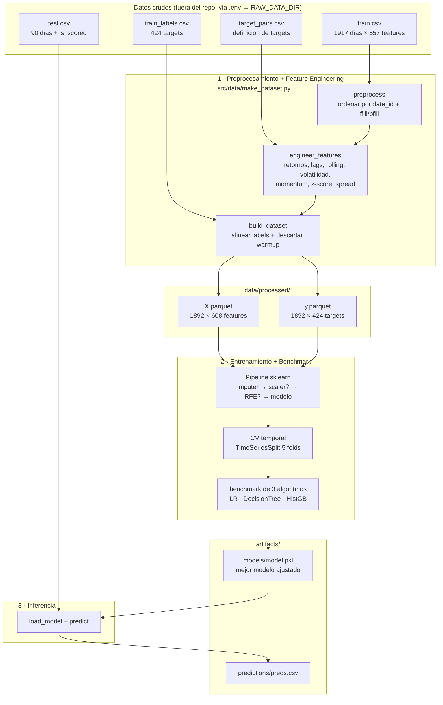

# Proyecto_ML_Engineering_DSRP_I_2026

Modelo de *machine learning* para mercados financieros, basado en el reto de Kaggle
**[MITSUI & CO. Commodity Prediction Challenge](https://www.kaggle.com/competitions/mitsui-commodity-prediction-challenge)**.

> Proyecto final — *Machine Learning Engineering I*, DataScienceResearchPeru (cohorte 2026).
> Estructura generada a partir de [cookiecutter-data-science](https://drivendata.github.io/cookiecutter-data-science/).

---

## Tabla de contenido

1. [Problema de ML](#a-problema-de-ml)
2. [Diagrama de flujo del proyecto](#b-diagrama-de-flujo-del-proyecto)
3. [Descripción del dataset y diccionario de datos](#c-descripción-del-dataset-y-diccionario-de-datos)
4. [Model Card](#d-model-card)
5. [Resultados — métricas offline y online](#e-resultados--métricas-offline-y-online)
6. [Conclusiones](#f-conclusiones)
7. [Cómo reproducir](#cómo-reproducir)

---

## a. Problema de ML

El reto original es de **regresión multi-objetivo sobre series de tiempo financieras**:
predecir simultáneamente **424 targets** (`target_0 … target_423`), cada uno el
**retorno logarítmico** de un instrumento o del *spread* (diferencia) entre dos
instrumentos, a un horizonte (*lag*) de 1, 2, 3 ó 4 días.

Para mantener el proyecto **acotado, reproducible y didáctico**, lo simplificamos a un
**único target** (definido en [src/config.py](src/config.py)):

| Concepto            | Valor |
|---------------------|-------|
| **Tipo de problema**| Regresión supervisada sobre series de tiempo |
| **Target**          | `target_4` |
| **Definición**      | `LME_AH_Close − JPX_Gold_Standard_Futures_Close` (spread aluminio LME vs. oro JPX) |
| **Horizonte (lag)** | 1 día |
| **Unidad**          | Retorno (variación relativa) del spread al día siguiente |
| **Variable objetivo**| Continua → métrica principal **RMSE** |

**Por qué es difícil.** Los retornos financieros son casi *ruido blanco*: tienen muy
poca señal predecible y mucha varianza. El reto no consiste en obtener un R² alto
(imposible en este dominio), sino en **extraer una ventaja estadística pequeña pero
consistente** y, sobre todo, en **no sufrir fuga de información temporal** (*look-ahead
bias*): toda *feature* en el día *t* usa exclusivamente datos disponibles hasta *t*.

---

## b. Diagrama de flujo del proyecto



> **Flujo en 3 comandos** — cada etapa tiene su script en [scripts/](scripts/):
> `run_preprocessing.py` → `run_training.py` → `run_prediction.py`
> (ver [Cómo reproducir](#cómo-reproducir)). La exploración interactiva vive en
> [notebooks/](notebooks/): `1.0-preprocesamiento-de-datos.ipynb` y
> `2.0-machine-learning-y-llms.ipynb`.

---

## c. Descripción del dataset y diccionario de datos

Fuente: **MITSUI & CO. Commodity Prediction Challenge** (Kaggle). Los datos crudos
**no se versionan** en el repositorio; su ubicación se resuelve desde `.env`
(`RAW_DATA_DIR`) en [src/config.py](src/config.py).

### Archivos

| Archivo | Forma | Descripción |
|---------|-------|-------------|
| `train.csv`         | 1917 × 558 | Niveles de precio diarios: `date_id` + **557 columnas** de instrumentos. |
| `train_labels.csv`  | 1917 × 425 | `date_id` + **424 targets** (`target_0 … target_423`) ya calculados. |
| `target_pairs.csv`  | 424 × 3    | Definición de cada target: `target`, `lag`, `pair`. |
| `test.csv`          | 90 × 559   | Datos de evaluación; incluye la columna `is_scored`. |
| `lagged_test_labels/` | —        | Utilidades de evaluación de Kaggle (labels rezagadas). |
| `kaggle_evaluation/`  | —        | API de scoring de la competencia (entorno online). |

### Diccionario de datos — *features* (`train.csv` / `test.csv`)

Las **557 columnas de features** son **niveles de precio** organizados por mercado.
El nombre codifica la fuente, el instrumento y el campo de precio
(`<MERCADO>_<INSTRUMENTO>_<CAMPO>`):

| Prefijo | N.º cols | Mercado | Ejemplos | Campos típicos |
|---------|---------:|---------|----------|----------------|
| `US_`  | 475 | Acciones / ETFs de EE. UU. | `US_Stock_ACWI_adj_open`, `US_Stock_AEM_adj_close` | `adj_open`, `adj_close`, `adj_high`, `adj_low`, `adj_volume` |
| `JPX_` | 40  | Futuros Japan Exchange | `JPX_Gold_Standard_Futures_Close`, `JPX_Platinum_Mini_Futures_Open` | `Open`, `High`, `Low`, `Close` |
| `FX_`  | 38  | Tipos de cambio (Forex) | `FX_AUDJPY`, `FX_EURUSD` | cotización del par |
| `LME_` | 4   | Metales London Metal Exchange | `LME_AH_Close` (aluminio), `LME_CA_Close` (cobre), `LME_PB_Close` (plomo), `LME_ZS_Close` (zinc) | `Close` |
| `date_id` | 1 | Índice temporal | entero secuencial (1 día = 1 paso) | clave de unión y orden |

### Diccionario de datos — *targets* (`train_labels.csv` + `target_pairs.csv`)

| Columna | Tipo | Descripción |
|---------|------|-------------|
| `date_id` | int | Día al que corresponde el retorno objetivo. |
| `target_0 … target_423` | float | Retorno futuro del instrumento o spread definido en `target_pairs.csv`. |
| `target` (en *pairs*) | str | Identificador del target. |
| `lag` (en *pairs*) | int ∈ {1,2,3,4} | Horizonte de predicción en días. **106 targets por cada lag.** |
| `pair` (en *pairs*) | str | Instrumento único (**4 targets**) o `A - B` para un spread (**420 targets**). |

**Target modelado (`target_4`):** `pair = LME_AH_Close - JPX_Gold_Standard_Futures_Close`, `lag = 1`.

### *Features* derivadas (dataset procesado `X.parquet` → 608 columnas)

[src/data/make_dataset.py](src/data/make_dataset.py) transforma los niveles crudos en
variables **estacionarias y sin fuga temporal**:

| Familia de feature | Construcción | Aplicada a |
|--------------------|--------------|------------|
| `ret_<col>` | Retorno simple (`pct_change`) | **todas** las columnas de precio |
| `<k>_ret_lag{1,2,3,5}` | Rezagos del retorno | instrumentos clave + spread |
| `<k>_ret_mean{5,10,20}` | Media móvil del retorno | instrumentos clave + spread |
| `<k>_ret_vol{5,10,20}` | Volatilidad (std móvil) | instrumentos clave + spread |
| `<k>_mom{5,10,20}` | Momentum (cambio acumulado en *w* días) | instrumentos clave + spread |
| `<k>_z{5,10,20}` | *z-score* del nivel vs. su media móvil | instrumentos clave + spread |

donde `<k>` ∈ { `LME_AH_Close`, `JPX_Gold_Standard_Futures_Close`, `spread` }.
Las primeras `WARMUP = max(WINDOWS)+max(LAGS) = 25` filas se descartan (contienen NaN
por los *rolling*/*lags*), dejando **1892 filas × 608 features**.

---

## d. Model Card

> Formato basado en la guía de [Model Cards de Kaggle](https://www.kaggle.com/code/var0101/model-cards) (Mitchell et al., 2019).

### Model details
- **Modelo:** `HistGradientBoostingRegressor` de scikit-learn, encapsulado en un
  `Pipeline` (`SimpleImputer(median)` → modelo). Hiperparámetros: `max_iter=300`,
  `learning_rate=0.05`, `random_state=0`.
- **Variante alternativa:** mismo pipeline con **RFE** (Recursive Feature Elimination,
  *ranker* = `DecisionTree`) para reducir a *k* features → `model_rfe.pkl`.
- **Algoritmos comparados:** `LinearRegression` (con `StandardScaler`),
  `DecisionTreeRegressor(max_depth=8)`, `HistGradientBoostingRegressor`.
- **Tipo:** regresión sobre series de tiempo. **Versión:** 1.0 (junio 2026).
- **Código:** [src/models/train_model.py](src/models/train_model.py).

### Intended use
- **Uso previsto:** estimar el retorno a 1 día del spread `LME_AH − JPX_Gold` con fines
  **educativos y de investigación** (pipeline de ML Engineering end-to-end).
- **Usuarios:** estudiantes y practicantes de ML aplicado a finanzas.
- **Fuera de alcance:** **no** apto para *trading* real ni decisiones de inversión. No
  generaliza a otros instrumentos sin re-entrenamiento.

### Factors
- Régimen de mercado (tendencia/volatilidad), liquidez del par, eventos macro y de
  política monetaria. El desempeño puede degradarse en regímenes no vistos en
  entrenamiento (*distribution shift*).

### Metrics
- **Principal:** RMSE (escala del retorno). **Complementarias:** MAE, R²,
  correlación de Pearson entre predicción y real.
- **Métrica del reto (online):** *Sharpe-like* = media de la correlación de rangos
  (Spearman) entre predicciones y reales, dividida por su desviación estándar.

### Training & evaluation data
- **Datos:** `train.csv` + `train_labels.csv` (MITSUI). Tras *feature engineering* y
  descarte de *warmup*: **1892 filas**, de las cuales **1609 tienen `target_4` no nulo**.
- **Evaluación:** **validación cruzada temporal** (`TimeSeriesSplit`, 5 folds): cada
  fold entrena con el pasado y valida con el futuro inmediato (sin barajar). Evita el
  *look-ahead bias* y es más estable que un corte único.

### Ethical considerations
- Modelo financiero: un uso indebido (decisiones de inversión reales) puede causar
  pérdidas económicas. Se distribuye solo con fines académicos.

### Caveats and recommendations
- R² negativo en CV → el modelo **apenas supera la media** (esperado en retornos casi
  aleatorios). La señal útil es marginal.
- Recomendado: extender a los 424 targets, validación *walk-forward* con re-entrenamiento
  periódico, e incorporar features exógenas (p. ej. sentimiento de noticias vía LLM, ver
  notebook 2.0).

---

## e. Resultados — métricas offline y online

### Métricas offline (validación cruzada temporal, 5 folds)

Benchmark de los 3 algoritmos sobre `target_4`, ordenado por **RMSE** (menor es mejor):

| Modelo | RMSE (media ± std) | MAE | R² (media) | Corr. (media) |
|--------|-------------------:|----:|-----------:|--------------:|
| **HistGradientBoosting** 🏆 | **0.01609 ± 0.00268** | **0.01216** | **−0.161** | **+0.0095** |
| DecisionTree | 0.02145 ± 0.00537 | 0.01527 | −1.236 | −0.0123 |
| LinearRegression | 0.05208 ± 0.03288 | 0.03574 | −18.06 | −0.0122 |

**Detalle por fold del mejor modelo (HistGradientBoosting):**

| Fold | n_train | n_valid | RMSE | MAE | R² | Corr. |
|-----:|--------:|--------:|-----:|----:|---:|------:|
| 1 | 269  | 268 | 0.01383 | 0.01046 | −0.195 | +0.021 |
| 2 | 537  | 268 | 0.01569 | 0.01196 | −0.284 | +0.005 |
| 3 | 805  | 268 | 0.02053 | 0.01524 | −0.025 | +0.083 |
| 4 | 1073 | 268 | 0.01417 | 0.01105 | −0.181 | −0.064 |
| 5 | 1341 | 268 | 0.01622 | 0.01209 | −0.121 | +0.003 |

**Lectura:** HistGradientBoosting es el más robusto y estable (menor RMSE y menor
varianza entre folds), y el único con correlación media **positiva** con el retorno
real. El RMSE bajo (~0.016) es consecuencia de que los retornos diarios son pequeños;
el R² negativo confirma que el techo de predictibilidad del dominio es muy bajo.
La regresión lineal es inestable (R² muy negativo) por la alta dimensionalidad (608
features) y la colinealidad de los precios.

### Métricas online (leaderboard de Kaggle)

La competencia evalúa la entrega mediante su **API de scoring** (`kaggle_evaluation/`)
sobre datos futuros, con una métrica tipo **Sharpe ratio de la correlación de Spearman**:
se calcula la correlación de rangos entre predicciones y reales en cada fecha y se
reporta `media / desviación estándar` a lo largo del tiempo.

> ⚠️ Esta es una **versión simplificada de un solo target con fines didácticos** y **no
> fue enviada al leaderboard oficial**, por lo que no se dispone de un *score* online
> público. El proxy más cercano a esa métrica en nuestra evaluación offline es la
> **correlación media positiva (+0.0095)** del mejor modelo, coherente con la naturaleza
> de "ventaja pequeña pero persistente" que premia la métrica online. La integración con
> la API de Kaggle queda planteada como trabajo futuro.

---

## f. Conclusiones

1. **Pipeline de ML Engineering completo y reproducible.** El proyecto cubre todo el
   ciclo —ingesta → preprocesamiento → *feature engineering* → entrenamiento con
   benchmark → inferencia— en módulos reutilizables (`src/`) y *scripts* ejecutables,
   con rutas centralizadas y datos crudos fuera del repo.

2. **HistGradientBoosting es el mejor modelo** del benchmark: menor RMSE
   (0.0161), mayor estabilidad entre folds y la única correlación media positiva.
   Los modelos lineales sufren con la alta dimensionalidad y colinealidad.

3. **El problema tiene un techo de predictibilidad bajo**, como es esperable en
   retornos financieros diarios: el R² negativo indica que se captura muy poca señal.
   El valor del proyecto está en la **metodología sin fuga temporal**
   (`TimeSeriesSplit`, features causales) más que en la exactitud puntual.

4. **La validación temporal es imprescindible.** Un *split* aleatorio inflaría
   artificialmente las métricas; `TimeSeriesSplit` da una estimación honesta de cómo
   se comportaría el modelo en producción.

5. **Trabajo futuro:** (i) escalar a los 424 targets multi-objetivo; (ii) validación
   *walk-forward* con re-entrenamiento periódico; (iii) probar LightGBM y selección de
   features (RFE ya integrado); (iv) enriquecer con señales exógenas vía **LLMs**
   (sentimiento de noticias de commodities, eventos macro), línea esbozada en el
   notebook `2.0-machine-learning-y-llms.ipynb`; (v) integrar la **API de scoring de
   Kaggle** para obtener una métrica online real.

---

## Cómo reproducir

```bash
pip install -r requirements.txt

# Configurar la ruta de los datos crudos en .env
#   RAW_DATA_DIR=.../mitsui-commodity-prediction-challenge
python -m src.config            # verifica que las rutas resuelven

# 1. Preprocesamiento  -> data/processed/X.parquet, y.parquet
python scripts/run_preprocessing.py

# 2. Entrenamiento     -> artifacts/models/model.pkl
python scripts/run_training.py

# 3. Predicción        -> artifacts/predictions/preds.csv
python scripts/run_prediction.py
```

### Estructura del repositorio

```
├── notebooks/
│   ├── 1.0-preprocesamiento-de-datos.ipynb   # carga + limpieza + feature engineering
│   └── 2.0-machine-learning-y-llms.ipynb     # benchmark ML + exploración LLMs
├── data/                 # raw / interim / processed (no versionado)
├── artifacts/            # salidas del proyecto
│   ├── models/           # modelos entrenados (.pkl)
│   ├── reports/          # reportes
│   └── predictions/      # predicciones (.csv)
├── src/                  # módulo de código reutilizable
│   ├── config.py         # rutas y constantes del problema (lee .env)
│   ├── data/make_dataset.py      # preprocesamiento + feature engineering
│   ├── features/build_features.py
│   └── models/{train_model.py, predict_model.py}
└── scripts/              # run_preprocessing / run_training / run_prediction
```
